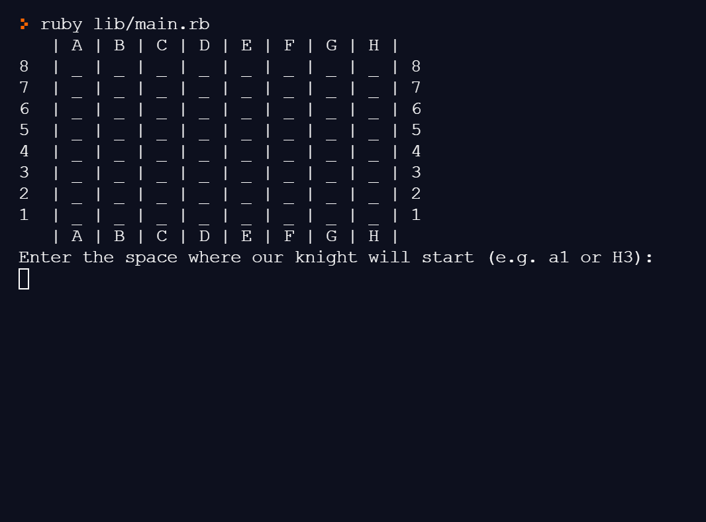

# Knight's Travails

In chess, a lone knight can travel to any space on the board, given enough moves.

This program implements a breadth-first search algorithm to determine the shortest path for a knight to travel from specified start and end spaces.

<br>

## Getting Started

You can use the program online [here](https://replit.com/@SG12/knightstravailsruby?v=1). If you would prefer to download the program, please use the instructions below.

### Prerequisites
* ruby >= 2.5.1

### Installation and Play

1. Clone this repo. [Instructions](https://docs.github.com/en/free-pro-team@latest/github/creating-cloning-and-archiving-repositories/cloning-a-repository)
1. Navigate into this project's directory ``` cd knights_travails ```
1. Run ``` ruby lib/main.rb ``` to start!